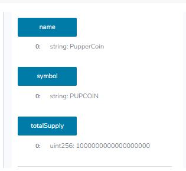
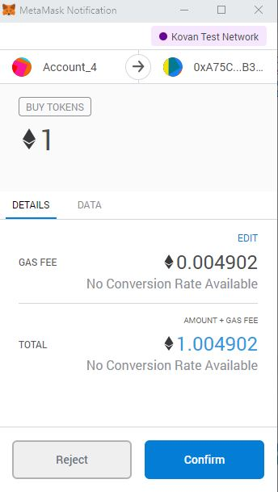
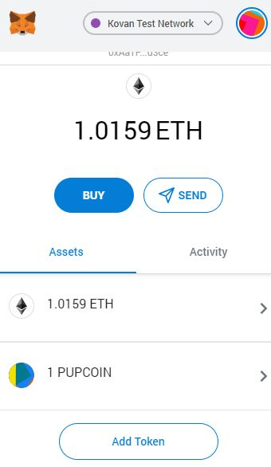

# You sure can attract a crowd!

Table of Contents:

  - [Background](#background)
  - [Creating the project](#creating-the-project)
  - [Designing the contracts](#designing-the-contracts)
   
      - [1.1: ERC20 PupperCoin](#11-erc20-puppercoin)
      - [1.2: PupperCoinCrowdsale](#12-puppercoincrowdsale)
      - [1.3:  PupperCoinCrowdsaleDeployer](#13--puppercoincrowdsaledeployer)
      - [1.4:  Testing the Crowdsale](#14--testing-the-crowdsale)
      - [1.5: Deploying the Crowdsale](#15-deploying-the-crowdsale)
        - [1.5.1: Deployment on Kovan testnet](#151-deployment-on-kovan-testnet)
        - [1.5.2: Buy Tokens under PupperCoinSale on Remix](#152-buy-tokens-under-puppercoinsale-on-remix)
        - [1.5.3: Add Custom Tokens in Metamask](#153-custom-tokens-metamask)
        -  [1.5.4: Custom Token in MyCrypto ](#154-custom-token-in-mycrypto)
- [Resources](#resources)
----------------------------------------

## Background

Your company has decided to crowdsale their PupperCoin token in order to help fund the network development.
This network will be used to track the dog breeding activity across the globe in a decentralized way, and allow humans to track the genetic trail of their pets. You have already worked with the necessary legal bodies and have the green light on creating a crowdsale open to the public. However, you are required to enable refunds if the crowdsale is successful and the goal is met, and you are only allowed to raise a maximum of 300 Ether. The crowdsale will run for 24 weeks.

You will need to create an ERC20 token that will be minted through a `Crowdsale` contract that you can leverage from the OpenZeppelin Solidity library.

This crowdsale contract will manage the entire process, allowing users to send ETH and get back PUP (PupperCoin).
This contract will mint the tokens automatically and distribute them to buyers in one transaction.

It will need to inherit `Crowdsale`, `CappedCrowdsale`, `TimedCrowdsale`, `RefundableCrowdsale`, and `MintedCrowdsale`.

You will conduct the crowdsale on the Kovan or Ropsten testnet in order to get a real-world pre-production test in.

## Creating the project

Using Remix, create a file called `PupperCoin.sol` and create a standard `ERC20Mintable` token. Since you're already an expert at this, you can simply use this [starter code](../Starter-Code/PupperCoin.sol).

Create a new contract named `PupperCoinCrowdsale.sol`, and prepare it like a standard crowdsale.

## Designing the contracts

### 1.1: ERC20 PupperCoin

Using `ERC20Mintable` and `ERC20Detailed` contract, hardcoding `18` as the `decimals` parameter, and leaving the `initial_supply` parameter alone.

There is no need to hardcode the decimals, however since most use-cases match Ethereum's default, you may do so.

Simply fill in the `PupperCoin.sol` file with this [starter code](../Starter-Code/PupperCoin.sol), which contains the complete contract you'll need to work with in the Crowdsale.

### 1.2: PupperCoinCrowdsale

Leverage the [Crowdsale](../Starter-Code/Crowdsale.sol) starter code, saving the file in Remix as `Crowdsale.sol`.

You will need to bootstrap the contract by inheriting the following OpenZeppelin contracts:

* `Crowdsale`

* `MintedCrowdsale`

* `CappedCrowdsale`

* `TimedCrowdsale`

* `RefundablePostDeliveryCrowdsale`

Providing parameters for all of the features of your crowdsale, such as the `name`, `symbol`, `wallet` for fundraising, `goal`, etc. Feel free to configure these parameters to your liking.

I hardcode a `rate` of 1, to maintain parity with Ether units (1 TKN per Ether, or 1 TKNbit per wei). If you'd like to customize your crowdsale rate, follow the [Crowdsale Rate](https://docs.openzeppelin.com/contracts/2.x/crowdsales#crowdsale-rate) calculator on OpenZeppelin's documentation. Essentially, a token (TKN) can be divided into TKNbits just like Ether can be divided into wei. When using a `rate` of 1, just like 1000000000000000000 wei is equal to 1 Ether, 1000000000000000000 TKNbits is equal to 1 TKN.

Since `RefundablePostDeliveryCrowdsale` inherits the `RefundableCrowdsale` contract, which requires a `goal` parameter, I called the `RefundableCrowdsale` constructor from  `PupperCoinCrowdsale` constructor as well as the others. `RefundablePostDeliveryCrowdsale` does not have its own constructor, so just use the `RefundableCrowdsale` constructor that it inherits.

**Note: If you forget to call the `RefundableCrowdsale` constructor, the `RefundablePostDeliveryCrowdsale` will fail since it relies on it (it inherits from `RefundableCrowdsale`), and does not have its own constructor.**

When passing the `open` and `close` times, I used `now` and `now + 24 weeks` to set the times properly from  `PupperCoinCrowdsaleDeployer` contract.

### 1.3:  PupperCoinCrowdsaleDeployer

In this contract, the deployment based off of the `ArcadeTokenCrowdsaleDeployer` I built previously. Leverage the [OpenZeppelin Crowdsale Documentation](https://docs.openzeppelin.com/contracts/2.x/crowdsales) for an example of a contract deploying another, as well as the starter code provided in [Crowdsale.sol](../Starter-Code/Crowdsale.sol).

### 1.4:  Testing the Crowdsale

- Test the crowdsale by sending Ether to the crowdsale from a different account (**not** the same account that is raising funds).
  
- After crowdsale work as expected, I added the token to MyCrypto and tested a transaction.
  
- Then test the time functionality by replacing `now` with `fakenow`, and create a setter function to modify `fakenow`. 

**Note: When sending Ether to the contract, make sure you hit your `goal` that you set, and `finalize` the sale using the `Crowdsale`'s `finalize` function. In order to finalize, `isOpen` must return false (`isOpen` comes from `TimedCrowdsale` which checks to see if the `close` time has passed yet). Since the `goal` is 300 Ether, you may need to send from multiple accounts. If you run out of prefunded accounts in Ganache, you can create a new workspace.**

Remember, the refund feature of `RefundablePostDeliveryCrowdsale` only allows for refunds once the crowdsale is closed **and** the goal is met. See the [OpenZeppelin RefundableCrowdsale](https://docs.openzeppelin.com/contracts/2.x/api/crowdsale#RefundableCrowdsale) documentation for details as to why this is logic is used to prevent potential attacks on your token's value.

### 1.5: Deploying the Crowdsale

Deploy the crowdsale to the Kovan or Ropsten testnet, and store the deployed address for later. Switch MetaMask to your desired network, and use the `Deploy` tab in Remix to deploy your contracts. Take note of the total gas cost, and compare it to how costly it would be in reality. Since you are deploying to a network that you don't have control over, faucets will not likely give out 300 test Ether. You can simply reduce the goal when deploying to a testnet to an amount much smaller, like 10,000 wei.

#### 1.5.1: Deployment on Kovan testnet

In order for crowdsale contracts to function accurately, smart contracts should be executed in the following order.

Open Ganache and Metamask, change the network to Kovan. Pre-fund the address to ensure successful deployment of the contract as it would require some Gas.

Deployment of the first contract puppercoin (Solidity codes written in this contract should be imported to Crowdsale.sol). Paramaters required for deployment: name, symbol, initial_supply.

Deploy PupperCoinSaleDeployer Contract. Parameters required: name, symbol, wallet (Same as your Wallet Address) and goal

Deploy PupperCoinSale Contract with Token_sale_address in the At_Address section

Deploy PupperCoin Contract with Token_Address in the At_Address section

Contract Deployed - Check the getter functions to see whether contract has been deployed properly.

#### 1.5.2: Buy Tokens under PupperCoinSale on Remix

#### 1.5.3: Custom Tokens MetaMask

Add Custom Tokens (PUPCOIN) to Metamask wallet that will then give an overview of ETH and PUPCOIN

#### 1.5.4: Custom Token in MyCrypto 

Add Custom Token in MyCrypto to reflect the new balance

-------------

  

